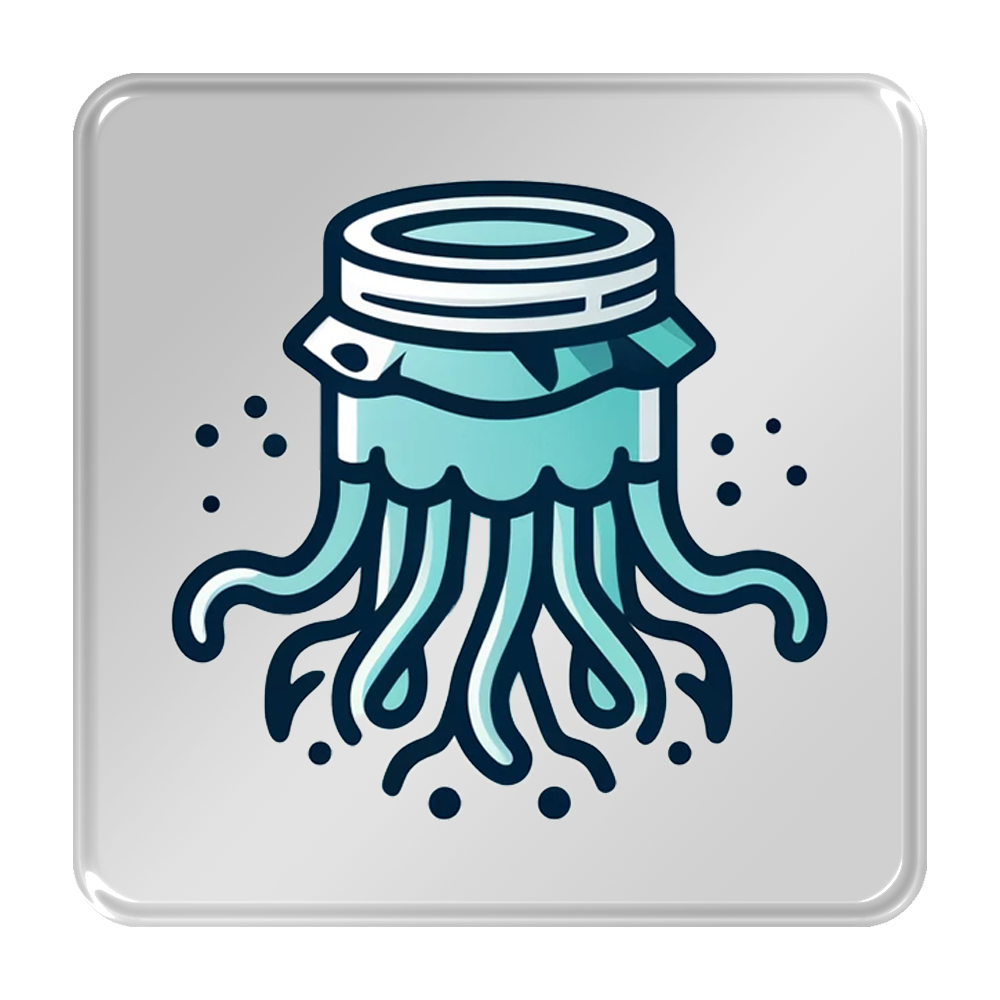
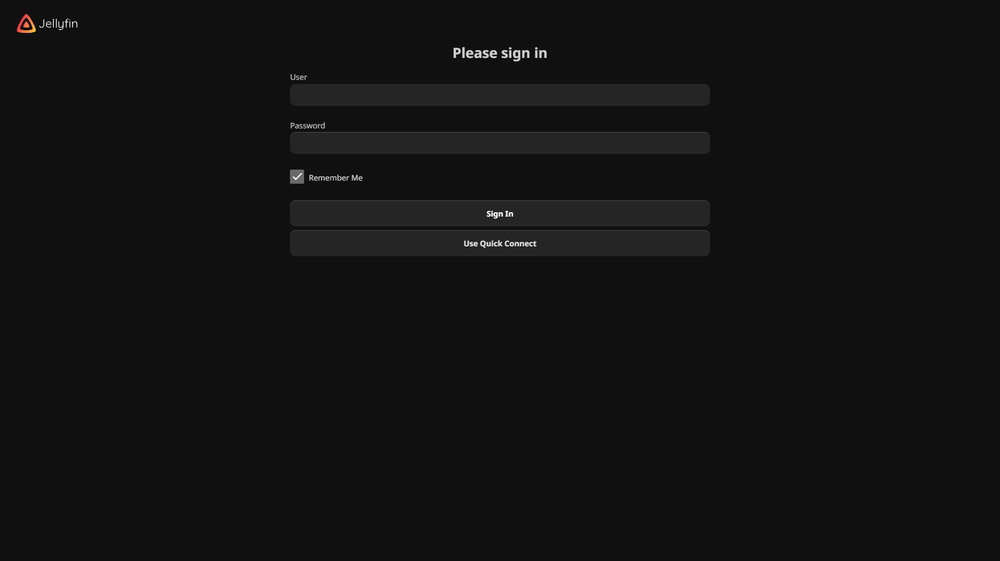
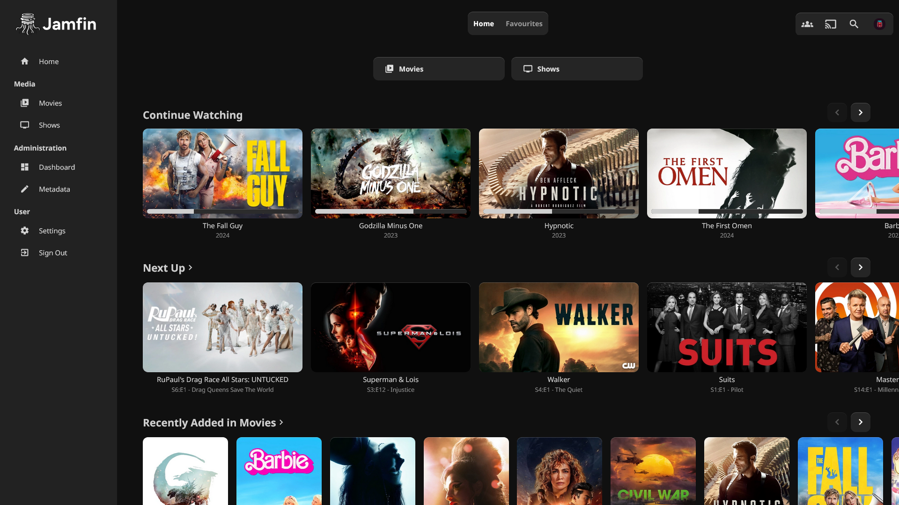
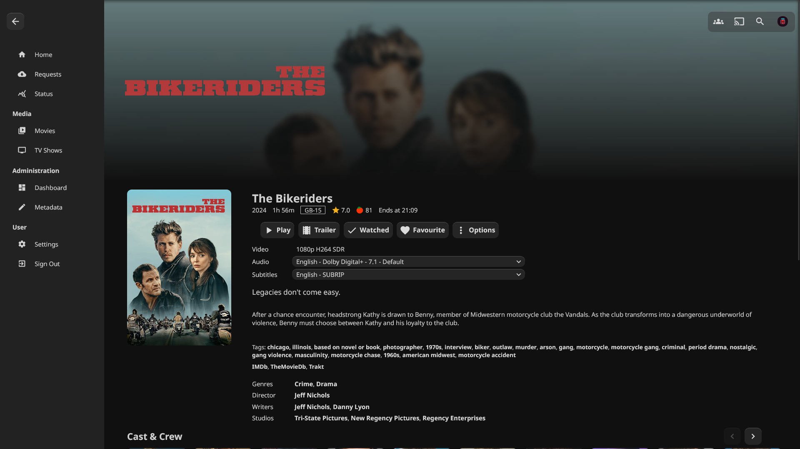
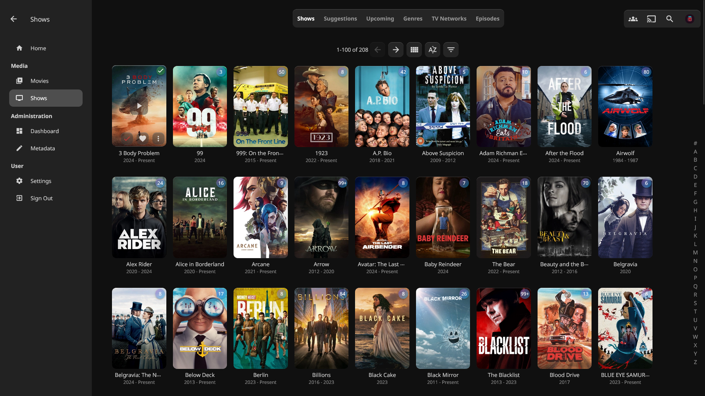
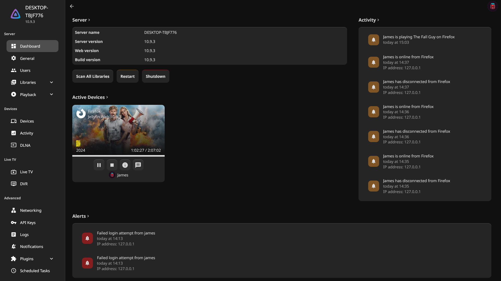

<div align="center">


( <a href="https://github.com/JamsRepos/Jamfin">About</a> - <a href="https://github.com/JamsRepos/Jamfin#examples">Screenshots</a> )

## ℹ️ Welcome

This project brings a modern, sleek glassmorphism design to Jellyfin, enhancing your media server's aesthetics. The theme is designed to be modular and compact, allowing server owners to easily customize their Jellyfin experience.

## 🧩 Modules

You can find our plug-and-play modules in the [modules folder](theme/modules/README.md). Each module's folder contains an explanation of its purpose and detailed instructions on how to use it.

## 🔌 Installation

The following line includes the base theme as well as all our optional modules. This is what our screenshots are based off.

<div align="left">

```css
@import url("releasing soon");
```

</div>

If you just want the theme without all our modules integrated, simply copy this line instead. Feel free to add the modules seperately.

<div align="left">

```css
@import url("releasing soon");
```

</div>

#### ❓Where do I install it?

Locate the `Custom CSS code` option under your General settings in the admin panel and simply paste the following line within the box.

If you wish to just install this for yourself only, you can do so by going to your users Display settings and copy the following settings.

- [x] Disable server-provided custom CSS code

Then enter the theme into the `Custom CSS code` option and save your settings.

## 🖌️ Customisation

Not sure if you like our colour scheme? No worries, we allow easy access to our themes colours. You can include them when importing our theme.
<div align="left">

```css
@import url("releasing soon");

:root {
    /* Colours */
    --theme-background-colour: #101010;
    --theme-sidebar-background-colour: #222222;
    --theme-menu-background-colour: #3a3a3a80;
    --theme-menu-shadow-colour: #fff3;
    --theme-base-colour: #696969;
    --theme--hover-colour: #dbdbdb;
    --theme-restart-colour: #da87287e;
    --theme-shutdown-colour: #c21c1c9d;

    /* General Appearance */
    --theme-roundness: .75rem;
    --theme-blur: 16px;
}
```

</div>

#### ❓How do I customise the colours for the module too?

You will find these within the respective modules folder, to cause less confusion they are excluded out of this example.

## 📷 Screenshots







</div>